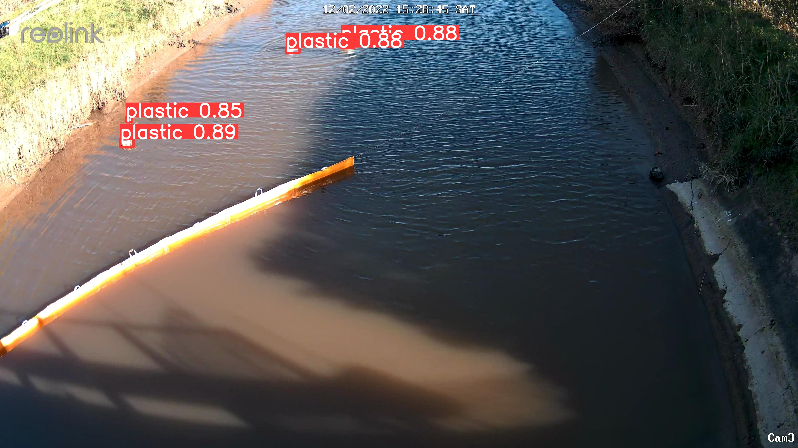

# Roboflow 와 Intel C3 Sapphire Rapids를 결합하여 하천 등 원격 환경 관리를 위한 컴퓨터 영상 시스템을 개발

이 기술 가이드에서는 Roboflow를 활용하여 시각적 데이터를 수집, 라벨 지정 및 처리한 후 모델 훈련 및 모델 배포를 위해 Intel C3 Sapphire Rapids를 활용하는 자율 하천 모니터링 및 청소 시스템을 구축하는 과정을 안내합니다

## 요구 사항

이 코도를 수행하기 위한 사전 설치되어야 할 사항들 ;
- Python 3.x
- OpenCV (`opencv-python`)
- Supervision (`supervision`)
- Requests (`requests`)
- Argparse (`argparse`) for command-line arguments

 `pip`로 설치 가능:

```bash
pip install opencv-python supervision requests argparse
```


